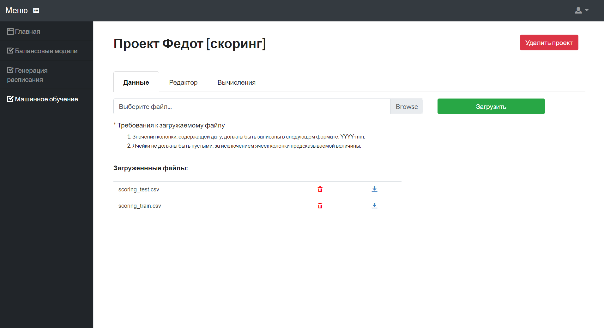
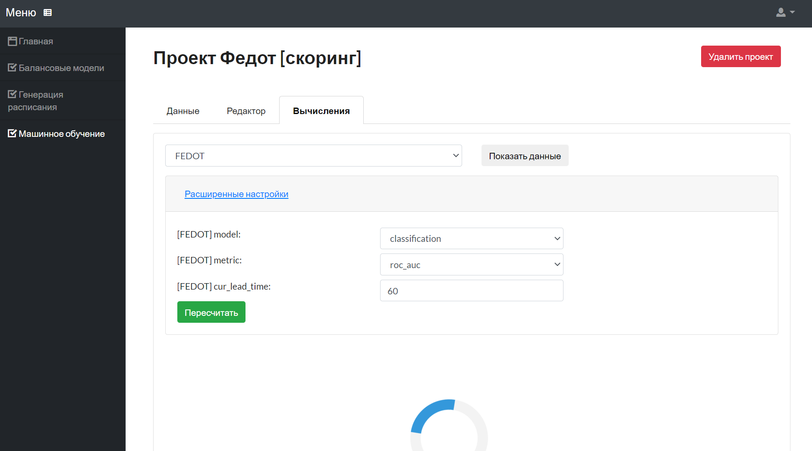
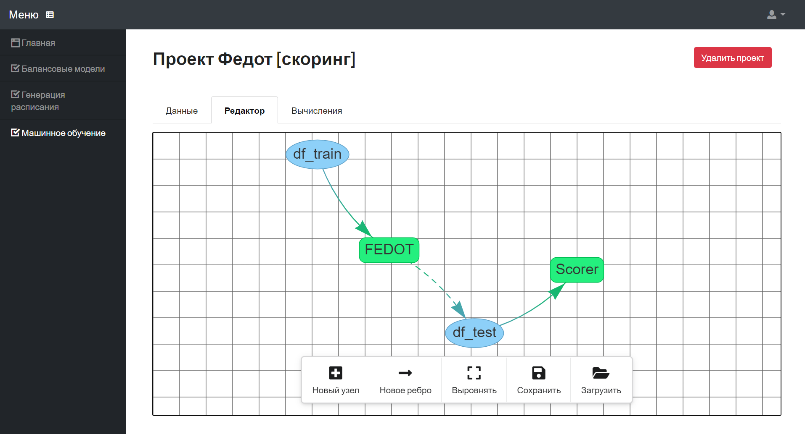
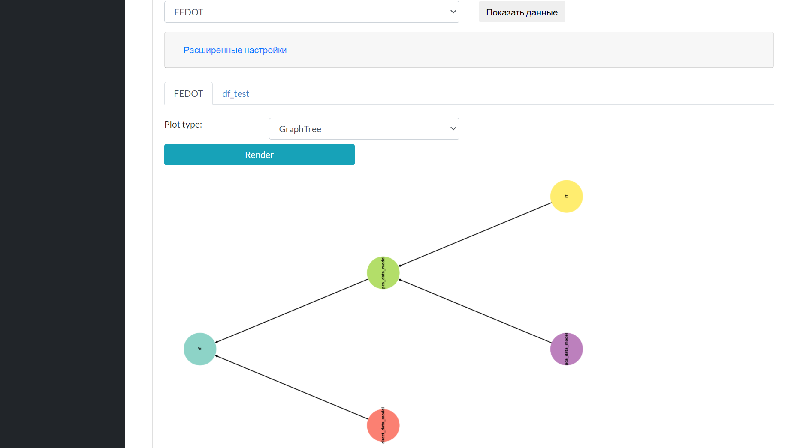
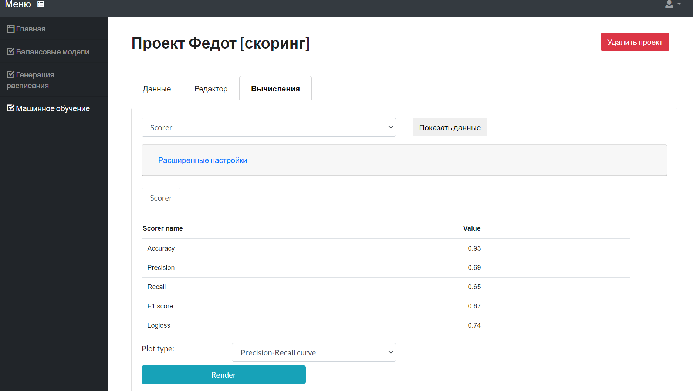

#The integration with the technological and business building models platform

The Fedot is integrated into the [platform](https://actcognitive.org/platformy/platforma-avtomatizatsii-postroeniya-modeley-tekhnologicheskikh-i-biznes-protsessov-na-osnove-setevykh-struktur-i-dannykh-izmereniy) for model building automation in technological and business processes based on network structures and measurement data. 

The platform provides a developer the tools for modeling technological processes and management decisions under conditions of uncertainty and incompleteness of data. It implements the logic for creating digital doubles of various organizational and technical systems and can serve as a basis for developing decision support tools for top management of high-tech industries. The use of the platform does not require programming skills and installation of additional software, making it available to a wide range of users.

The example of different cases solved with Fedot as a part of platform:

The following images illustrates the different aspects of the integration.

It can be seen that Fedot is successfully integrated to the platform.
