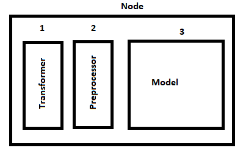
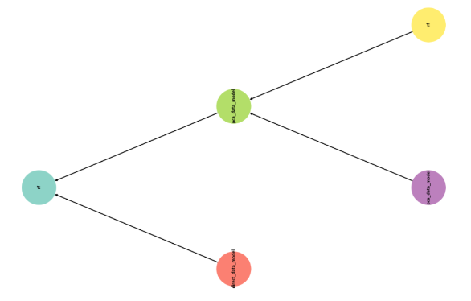
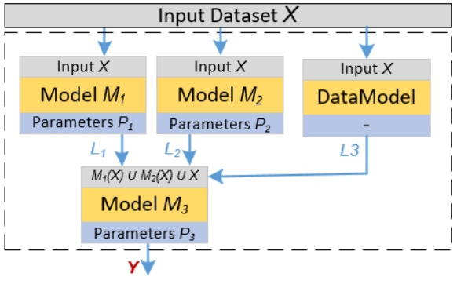

##The chain with the data preprocessing models:

Transformer converts data formats, preprocesor - changes their "scale" through skaling/normalization, etc.



More complex operations with data are located in separate models. 
For example, data enrichment or dimensionality reduction can be done as:



The direct datamodel allow to enrich the model inputs with the raw data:



The data prerocessing model for the table data can be added to the repository as follows:

```json
"pca_data_model": {
	  "meta": "dim_red_data_model",
	  "tags": ["linear"]
	}

"dim_red_data_model": {
	  "tasks": "[TaskTypesEnum.classification, TaskTypesEnum.regression]",
	  "input_type": "[DataTypesEnum.table]",
	  "output_type": "[DataTypesEnum.table]",
	  "strategies": ["core.models.evaluation.data_evaluation", "DataModellingStrategy"],
	  "tags": ["without_preprocessing", "data_model"],
	  "description": "Implementations of the models for the feature preprocessing (dimensionality reduction, etc)"
	}
```

The following python code can be used to create the chain with datamodel:

```python
node_first = PrimaryNode('pca_data_model')
    node_second = PrimaryNode('lda')
    node_final = SecondaryNode('rf', nodes_from=[node_first, node_second])

    chain = Chain(node_final)
```

The data prerocessing model for the time series:


It can be created as follows:

```python
chain = Chain()
node_trend = NodeGenerator.primary_node(ModelTypesIdsEnum.trend_data_model)
node_lstm_trend = NodeGenerator.secondary_node(ModelTypesIdsEnum.lstm, nodes_from=[node_trend])

node_residual = NodeGenerator.primary_node(ModelTypesIdsEnum.residual_data_model)
node_ridge_residual = NodeGenerator.secondary_node(ModelTypesIdsEnum.ridge, nodes_from=[node_residual])

node_final = NodeGenerator.secondary_node(ModelTypesIdsEnum.additive_data_model,
                                          nodes_from=[node_ridge_residual, node_lstm_trend])
chain.add_node(node_final)
```