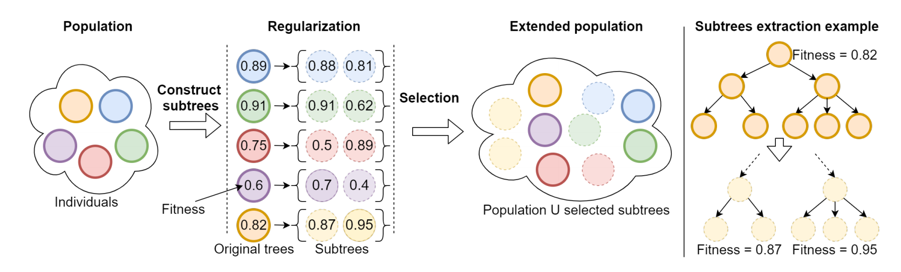
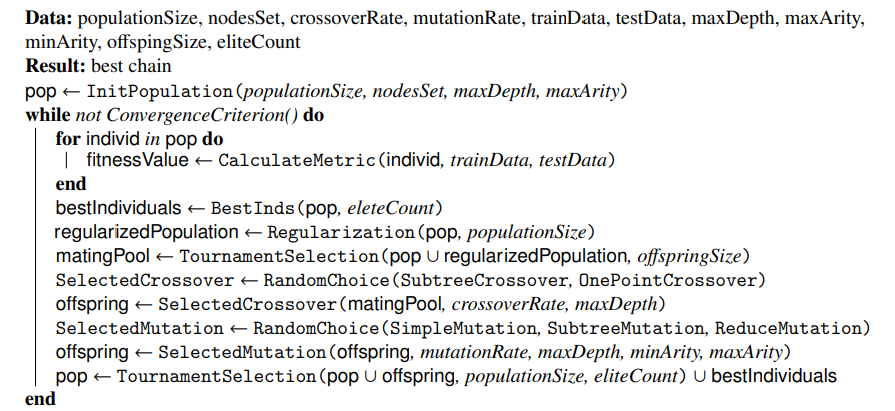
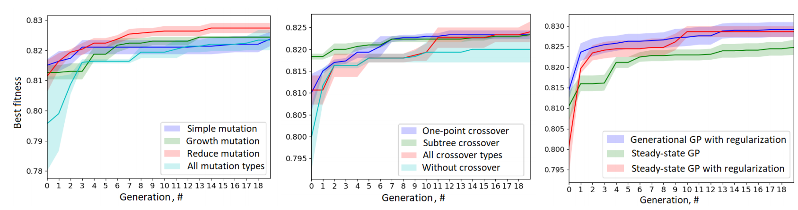

## The building of the minimum required chain

As a part of the composing algorithm, we developed a regularization operator which is applied to the
population before the parents selection procedure to provide more sustainable behavior of the evolutionary algorithm.

The logic of the regularization operator.

The regularization are integrated in the common algorithm as follows:

The pseudo-code of the minimal chain identification algorithm.

The regularization suppresses unnecessarily growing of trees by the finding competitive subgraphs (rooted tree)
among all possible unique subtrees of current population individuals and adding them to parents set (in a case of large
trees, during regularization it is possible to subtract the only fixed number of random subtrees for a tree). The number
of additional subtrees was set equals to population size. Experiments show that the regularization provides a positive
influence for composing algorithm and improves its convergence:

The comparison of the different operators.

Also, state-of-the art [parameter-free scheme](https://www.researchgate.net/publication/338883598_An_Adaptive_and_Near_Parameter-free_Evolutionary_Computation_Approach_Towards_True_Automation_in_AutoML) is implemented as a part of algorithm 