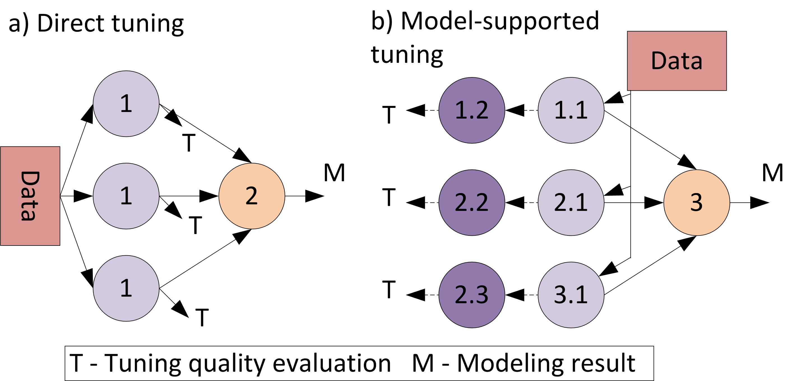

## Hyperparameters tuning in the Fedot

Consider learning quality improvement it is needed to pay attention
to different sub-processes besides model selection.
One of that sub-processes of hyper-parameter tuning was implemented in FEDOT framework.

Since the result of the composing a tree-based structure, 
it was suggested to tune the leaf and root nodes separately. 
Leaf nodes or "primary" in terms of FEDOT contain the initial data and 
models in that nodes can be tuned to the original problem while the 
model located in the root is tuned to the modified data. 

The different tuning approaches in Fedot:




The first two methods were used from sklearn package as RandomizedSearchCV and BayesSearchCV algorithms. The customized approach has a random choice as a base, includes cross-validation technique and works as follow:
- it calculates the defined quality metric on default parameters
- choose parameters from search space randomly
- fit the model via cross-validation and calculate the same metric again.
If the new metric is better than the previous one, then the new model with parameters of the current iteration will be used in further evaluation. It may seem to be the same flow as in the Randomized approach "out of the box". However, the experiments provided different results. 

The example of tuning in Fedot:

```python
chain = get_regr_chain()

# Before tuning prediction
chain.fit(train_data, use_cache=False)
before_tuning_predicted = chain.predict(test_data)

# Chain tuning
chain.fine_tune_primary_nodes(train_data, max_lead_time=timedelta(minutes=1), iterations=10)

# After tuning prediction
chain.fit(train_data)
after_tuning_predicted = chain.predict(test_data)
```

The description of tuning API is available in the [documentation](https://fedot.readthedocs.io/en/latest/api/tuning.html).