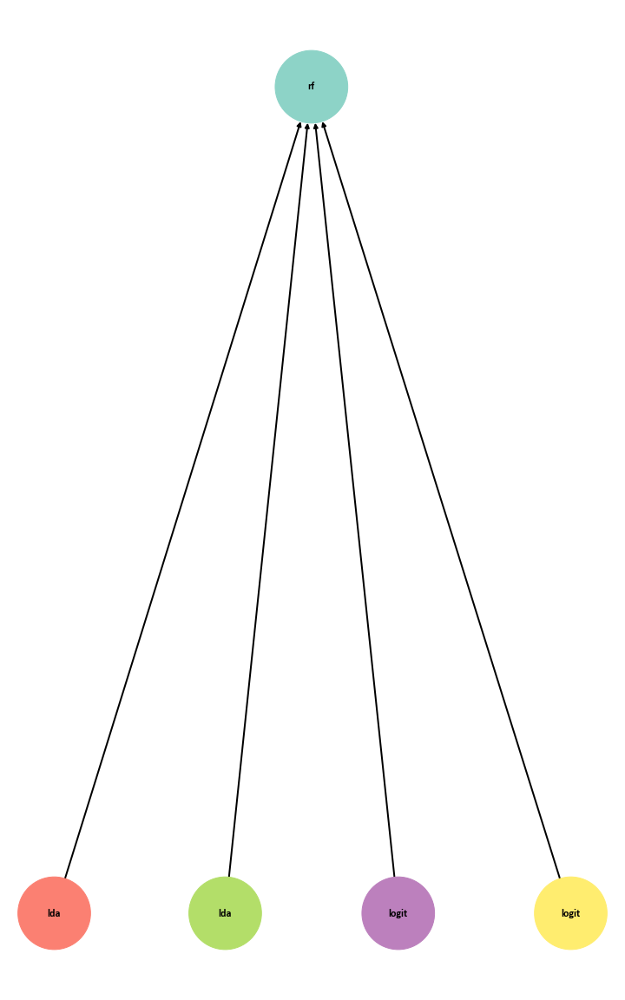

## Detailed task description
It is important that banks are able to recognize fraudulent credit card transactions so that customers are not charged for goods they did not buy.
The data sets contain transactions made by European credit card holders in September 2013. This data set shows transactions that took place in two days, of which we have 492 fraudulent transactions out of 284,807. The data set is highly unbalanced, the positive class (fraud) accounts for 0.172% of all transactions.  
The dataset contains only numeric input variables, which are the result of PCA conversion. Unfortunately, due to privacy problems we cannot be provided with the original functions and additional background information about the data. Characteristics V1, V2,... V28 are the main components obtained with PCA, the only functions that were not converted with PCA are "Time" and "Sum". The "Time" function contains the seconds elapsed between each transaction and the first transaction in the dataset. The "Class" function is an answer variable that takes 1 in case of fraud and 0 otherwise.


The stages of creating a composite model using the FEDOT framework
1) The first step is to transform our dataset so that the last column contains our target variable (Y). 
2) The second step is to create a function that will calculate the optimal composite model. To solve the problem of determining fraudulent transactions with bank cards, the following function was written:

```python
def get_model(train_file_path: str, cur_lead_time: datetime.timedelta = timedelta(minutes=5)):
    task = Task(task_type=TaskTypesEnum.classification)
    dataset_to_compose = InputData.from_csv(train_file_path, task=task)

    # the search of the models provided by the framework
    # that can be used as nodes in a chain for the selected task
    models_repo = ModelTypesRepository()
    available_model_types, _ = models_repo.suitable_model(task_type=task.task_type)

    metric_function = MetricsRepository(). \
        metric_by_id(ClassificationMetricsEnum.ROCAUC_penalty)

    composer_requirements = GPComposerRequirements(
        primary=available_model_types, secondary=available_model_types,
        max_lead_time=cur_lead_time, max_arity=3,
        max_depth=4, pop_size=20, num_of_generations=100, 
        crossover_prob = 0.8, mutation_prob = 0.8, 
        add_single_model_chains = True)

    # Create the genetic programming-based composer, that allow to find
    # the optimal structure of the composite model
    composer = GPComposer()

    # run the search of best suitable model
    chain_evo_composed = composer.compose_chain(data=dataset_to_compose,
initial_chain=None,
composer_requirements=composer_requirements,
metrics=metric_function, 
is_visualise=False)
    
    chain_evo_composed.fit(input_data=dataset_to_compose)

    return chain_evo_composed
```

 
It is important to understand that the higher the values of the parameters to find the optimal model are set, the more RAM is required. The time to search for the optimal model is limited by the number of generations (num_of_generations), or by setting a limit on the search time. 
There were a number of difficulties associated with obtaining a single model instead of a composite model. This could be corrected by setting the add_single_model_chains=False parameter, or by setting a longer search time for the optimal model and therefore a larger value for the num_of_generations parameter.
In the case we are considering, the dataset contains 290,000 records and the composite model took too long to build. Since the original data set was not balanced, in order to speed up the model search, it was decided to balance the dataset by a minority class, thus reducing the dataset size.
For this purpose, the following function was written: 

```python
def balance_class(file_path):
    """
    Function to balace our dataset to minority class.
    """
    file_name = file_path.replace('.', '/').split('/')[-2]
    
    df = pd.read_csv(file_path)
    
    X = df.drop(columns=['Class'])
    y = df.iloc[:,[-1]]

    rus = RandomUnderSampler(sampling_strategy = 'all', random_state=42)
    
    X_res, y_res = rus.fit_resample(X, y)
    X_res['Class'] = y_res
    
    df_balanced = shuffle(X_res, random_state = 42).reset_index().drop(columns='index')
    df_balanced.to_csv(fr'./{file_name}_underSample.csv', index=False)
    
    full_path = './' + file_name + '_underSample.csv'
    
    return full_path
```

 This function balances the original dataset by a minority class. 
3) The third step is to write a function that will estimate the result of a composite model on a certain data set. Since the task assigned to us is a classification task, it is necessary to consider the following metrics: precision, recall, accuracy, roc_auc, f1_metric. 

```python
def apply_model_to_data(model: Chain, data_path: str):
    """
    Applying model to data and check metrics.
    """
    dataset_to_validate = InputData.from_csv(data_path)
    
    predicted_labels = model.predict(dataset_to_validate).predict

    
    roc_auc_st = round(roc_auc_score(y_true=dataset_to_validate.target,y_score=predicted_labels.round()), 4)
                              
    p = round(precision_score(y_true=dataset_to_validate.target,y_pred=predicted_labels.round()), 4)
    r = round(recall_score(y_true=dataset_to_validate.target,y_pred=predicted_labels.round()), 4)
    a = round(accuracy_score(y_true=dataset_to_validate.target,y_pred=predicted_labels.round()),4 )
    f = round(f1_score(y_true=dataset_to_validate.target,y_pred=predicted_labels.round()), 4)
    
    return roc_auc_st, p, r, a, f
```
 
4) The last step is to collect the written functions and make conclusions about the obtained model based on the obtained metrics. 

```python
file_path = r'./creditcard.csv'

file_path_first = balance_class(file_path)

train_file_path, test_file_path = create_multi_clf_examples_from_excel(file_path_first)

fitted_model = get_model(train_file_path)

ComposerVisualiser.visualise(fitted_model, save_path = f'./model.png')

roc_auc, p, r, a, f = apply_model_to_data(fitted_model, test_file_path)
print(f'TEST/TRAIN SCORE \nROC AUC metric is {roc_auc} \nPRECISION is {p} \nRECALL is {r} \nACCURACY is {a} \nF1_score is {f}')

roc_auc, p, r, a, f = apply_model_to_data(fitted_model, file_path)
print(f'Applying model to all data \nROC AUC metric is {roc_auc} \nPRECISION is {p} \nRECALL is {r} \nACCURACY is {a} \nF1_score is {f}')
```

The first step is to specify the location of the original dataset. Then, the classes are balanced, after which the sample is divided into training and test ones. The next step is launch of composite model search. For clarity, we have an opportunity to visualize our model by presenting it as a tree. In the last step we consider our metrics in the test sample. 
After performing the steps described above, the following model was obtained for the balanced dataset:


 
The resulting composite model consists of 4 primary_nodes (the input gets the dataset) and 1 secondary_node (the input gets the results of the previous models).   Precision shows what proportion of objects called positive by the classifier, but really are positive. It is counted as TP/(TP+FP). Because the original dataset is not balanced, it is not quite correct to apply this metric.
We can compare the obtained metrics of the composite model with the results of Kaggle. The new composite model shows itself no worse than the models presented by users with Kaggle, and in some places even better.
When solving the task of determining fraudulent transactions with bank cards, it is important to prevent the gender from being written off the account.

Author: Timur Kutuev