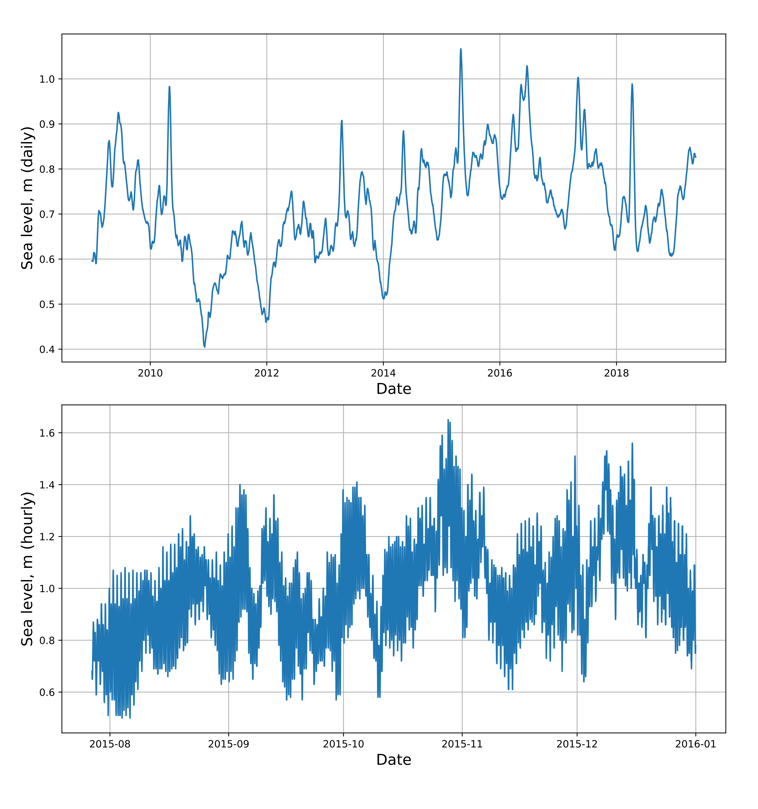
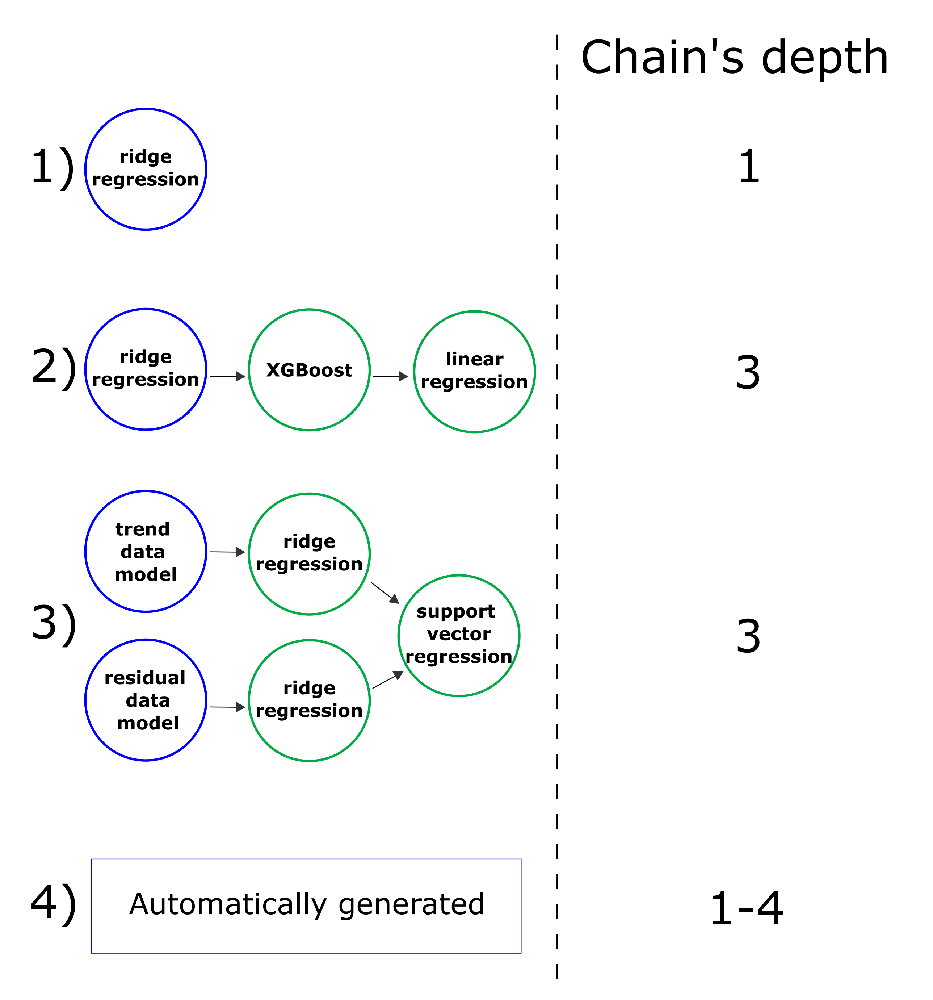
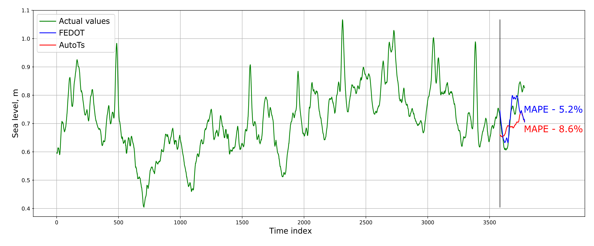
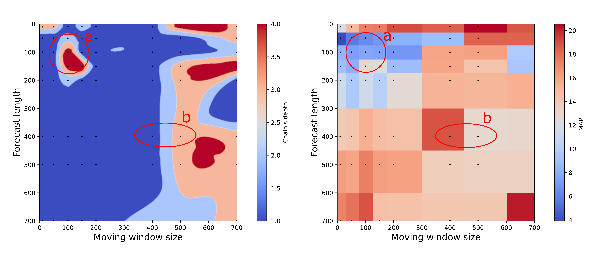

## Time series forecasting. Metocean example

Time series processing is widely used in engineering and scientific tasks. 
One of the most common cases with time series is forecasting, when we try to predict values in the future based on historical data. 
In this application example, we will demonstrate the capabilities of the FEDOT framework and the [AutoTs](https://github.com/winedarksea/AutoTS) competitor library (and compare them) in time series forecasting. 
We will perform a comparative analysis of the two libraries using the example of time series forecasting with different discreteness and different forecast lengths.

Time series with daily data was obtained from satellite altimetry gridded [data](https://cds.climate.copernicus.eu/cdsapp#!/dataset/satellite-sea-level-global?tab=overview) (Figure 1). 

Figure 1. Map of the location of the point where sea surface height above the average surface of the geoid (the heatmap is presented for 01.01.2003) values were extracted.

Time series with hourly data was obtained from NEMO model for a point in Arctic region.

Figure 2. Time series of sea height with the length of 3784 elements

Considered forecast lengths - 10, 50, 100, 150, 200, 400, 500, 700 elements. 
Metrics: mean absolute error (MAE) and mean absolute percentage error (MAPE).

Four different chains were used for FEDOT-based forecasting. 
Three of them were set manually and their structure did not change during the model training. 
The 4th chain was selected automatically using an evolutionary algorithm (Figure 3).

Figure 3. Example of the chains used for forecasting. 1) – single-model chain, 2) – simple chain, 3) - multiscale chain, 4) – generated chain.

The predictions of the first-level model are predictors for the second-level model, etc. 
As can be seen from the Figure 3, it is possible to predict the trend and the remnants of the trend separately. 
For more information about such time series forecasting approach (with trend and residuals), you can check this [page](https://itmo-nss-team.github.io/FEDOT.Docs/real_cases/multiscale-forecasting). 

### Time series preprocessing

In FEDOT, the approach to building models on time series is based on lagged data transformation. 
The general concept of how the model is trained can be seen in the animation below. 
A table is compiled where the features are elements of a time series taken with different lags.

Thus, on the compiled table, it is possible to train both single machine learning models, and to build chains of several models, as FEDOT can do.

If you are interested in a more detailed analysis of how you can forecast time series using FEDOT, then see the detailed [tutorial](https://github.com/nccr-itmo/FEDOT/blob/master/notebooks/time_series_forecasting/Time%20series%20forecasting%20with%20FEDOT.ipynb).

As you can see from the animation, a very important hyperparameter of the algorithm is the size of the moving window. 
In this case, it was equal to 3 elements, but you can use any integer number. 
In order to determine the most optimal size of the sliding window, a complete search was used for the following window sizes: 10, 50, 100, 150, 200, 400, 500, 700 elements. 
The algorithm launch’s metrics were averaged 5 times for each set of hyperparameters. 
The AutoTs library also used the error averaging procedure for 5 launches.

## Results

Below is a picture with an example of a forecast for 200 elements for daily sea level data.

Figure 4. Examples of forecasts from the AutoTs library and generated chain

The average results are summarized in several tables:

Table 1. Obtained metrics of FEDOT chains with the best moving window size. The size of the moving window is shown in brackets.

<table class="tg">
<thead>
  <tr>
    <th class="tg-c3ow" rowspan="2">  Algorithm</th>
    <th class="tg-c3ow" colspan="2">    Daily data   </th>
    <th class="tg-c3ow" colspan="2">    Hourly data   </th>
  </tr>
  <tr>
    <td class="tg-c3ow">    MAE   </td>
    <td class="tg-c3ow">    MAPE   </td>
    <td class="tg-c3ow">    MAE   </td>
    <td class="tg-c3ow">    MAPE   </td>
  </tr>
</thead>
<tbody>
  <tr>
    <td class="tg-c3ow">Single-model chain (baseline)</td>
    <td class="tg-c3ow">0.059 (100)</td>
    <td class="tg-c3ow">8.14 (200)</td>
    <td class="tg-c3ow">0.118 (10)</td>
    <td class="tg-c3ow">11.52 (10)</td>
  </tr>
  <tr>
    <td class="tg-c3ow">Simple chain</td>
    <td class="tg-c3ow">0.070 (700)</td>
    <td class="tg-c3ow">9.60 (700)</td>
    <td class="tg-c3ow">0.137 (50)</td>
    <td class="tg-c3ow">13.78 (50)</td>
  </tr>
  <tr>
    <td class="tg-c3ow">Multiscale chain</td>
    <td class="tg-c3ow">0.058 (10)</td>
    <td class="tg-c3ow">8.00 (10)</td>
    <td class="tg-c3ow">0.163 (150)</td>
    <td class="tg-c3ow">16.82 (150)</td>
  </tr>
  <tr>
    <td class="tg-7btt">Generated chain</td>
    <td class="tg-7btt">0.056 (200)</td>
    <td class="tg-7btt">7.47 (200)</td>
    <td class="tg-7btt">0.118 (10)</td>
    <td class="tg-7btt">11.49 (10)</td>
  </tr>
</tbody>
</table>

Table 2. Comparison of the FEDOT-based time series forecasting algorithm and the AutoTS library. Averaged metrics for all variants of moving window sizes and algorithm launches.

<table class="tg">
<thead>
  <tr>
    <th class="tg-c3ow" rowspan="2">  Algorithm</th>
    <th class="tg-c3ow" colspan="2">    Daily data   </th>
    <th class="tg-c3ow" colspan="2">    Hourly data   </th>
  </tr>
  <tr>
    <td class="tg-c3ow">    MAE   </td>
    <td class="tg-c3ow">    MAPE   </td>
    <td class="tg-c3ow">    MAE   </td>
    <td class="tg-c3ow">    MAPE   </td>
  </tr>
</thead>
<tbody>
  <tr>
    <td class="tg-c3ow">FEDOT generated chain</td>
    <td class="tg-c3ow">0.064</td>
    <td class="tg-c3ow">8.69</td>
    <td class="tg-c3ow">0.132</td>
    <td class="tg-c3ow">13.39</td>
  </tr>
  <tr>
    <td class="tg-c3ow">AutoTS</td>
    <td class="tg-c3ow">0.083</td>
    <td class="tg-c3ow">11.36</td>
    <td class="tg-c3ow">0.159</td>
    <td class="tg-c3ow">17.19</td>
  </tr>
</tbody>
</table>

As you can see from the table 2, the FEDOT-based algorithms were more accurate. 
The results of the analysis of the chains obtained by the evolutionary algorithm and their prediction accuracy are shown in Figure 5.

Figure 5. Results of the chains obtained by the evolutionary algorithm for sea level forecasting for hourly data.

From the Figure 5 can be seen that for small values of the moving window, the evolutionary algorithm gives preference to simple chains with single model. 
With the increase of the moving window algorithm can detect more complex patterns in the data and to grow deeper chains.

Case a shows that not always deeper chains give less error, sometimes single models do better, and the evolutionary algorithm in most cases prefers them. 
Case b shows that for longer moving window sizes, it is advisable to build deeper chains, since their use allows making more accurate forecasts.

## Conclusion

Thus, we saw that in these examples, FEDOT-based forecasting algorithms are more accurate than the competitor AutoTS library. 
The evolutionary algorithm finds more optimal solutions than the chains set manually. 
To build the most complex models, it makes sense to build algorithms on large sliding window sizes.