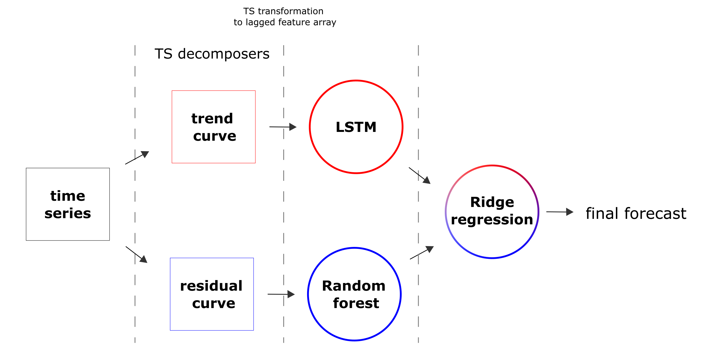

## Sea surface height forecasting problem

One of the well-known modeling tasks is a simulation of the time series. One of the real-world cases, connected with this task, is a metocean forecasting. The prediction of the weather or climate in a single spatial point is an actual and important problem for the many industrial and R&D activities.
To separate the metocean process into several scales, an iterative approach can be used to extract each scale. This approach consists of the application of the LSTM network and the subtraction of its prediction results from the original time series. Using this architecture, a non-linear trend can be distinguished from a non-stationary time series during the first iteration. The next iteration gives some resemblance to the seasonal component.
The advantage of this approach can be considered to be the extraction of the trend and seasonal component without a priori assumptions about their shape. However, the same feature can be understood as a disadvantage, meaning the resulting components are less interpretable because a neural network is used.
As an example of the metocean forecasting task, the time series of the surface height at the point obtained from the modelling results of the NEMO model for the Arctic region was taken. An LSTM model was used to predict values at the next point in time. Its architecture is shown below.


A lag window equal to 12 hours was chosen for the experiment. Thus, using values in the previous 12 hours to train the neural network, we try to predict what will happen at the next point in time.
At the initial block of the model, Conv1d layers can be used to find patterns in a time series (such as curvature). An adding noise layer from the normal distribution to the input data was also added - this technique helps to avoid over-learning of the model. The last TimeDistributed layer converts the resulting features from the previous layers to the output value. Inside it, a Dropout layer is used - which also helps avoid over-learning.
 
Two decomposition scales are shown as an example. The first of them is a trend component. An example of the highlighted trend is shown below.


On the left: selected trend component (orange) against the original time series (full data set); on the right, the difference between the selected trend and the original time series (the seasonal component).


On the left: the selected trend component (orange) vs the background of the original time series (part of the dataset); on the right: the difference between the selected trend and the original time series is the seasonal component.
 
After training, the trend model  was tested on a validation sample. All validation samples, predictions and their difference (seasonal component) is shown below.
Top-down: the resulting trend model, validation sample and their difference:


The resulting trend model has a standard error of 0.01 m on the validation sample.
 
 
The model for the seasonal component was obtained similarly. The results of the validation sample prediction are shown below.
The result of predicting the seasonal component model (orange) on the entire validation sample (blue).


 The result of predicting the seasonal component model (orange) was compared with the validation sample (blue).


The resulting seasonal component model has a standard error of 0.03 m on the validation sample.
 	
The implementation of such structure (LSTM+regression model for different scales) as Fedot composite model can be represented as follows:



So, the implementation of the described model can be obtained by following code:

```python
chain = Chain()
node_trend = NodeGenerator.primary_node(ModelTypesIdsEnum.trend_data_model)
node_lstm_trend = NodeGenerator.secondary_node(ModelTypesIdsEnum.lstm, nodes_from=[node_trend])

node_residual = NodeGenerator.primary_node(ModelTypesIdsEnum.residual_data_model)
node_ridge_residual = NodeGenerator.secondary_node(ModelTypesIdsEnum.ridge, nodes_from=[node_residual])

node_final = NodeGenerator.secondary_node(ModelTypesIdsEnum.additive_data_model,
                                          nodes_from=[node_ridge_residual, node_lstm_trend])
chain.add_node(node_final)
```
To obtain a forecast, the chain_lstm.predict(dataset_to_validate) should be called.

The forecasts with different depth are differs as:


The example of the optimisation for the predictive chain:

